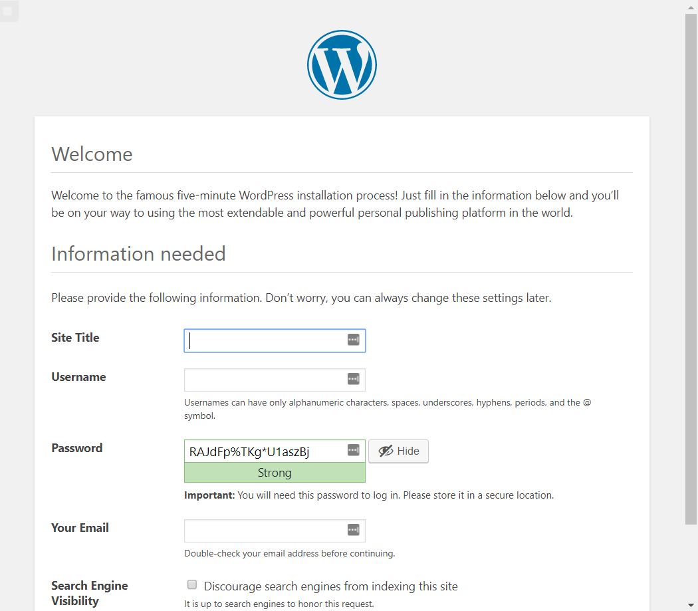
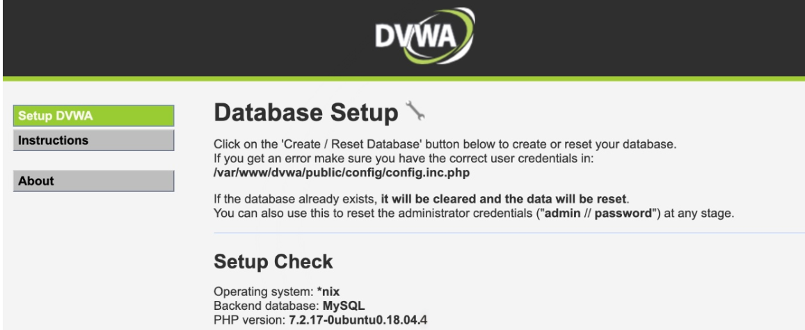
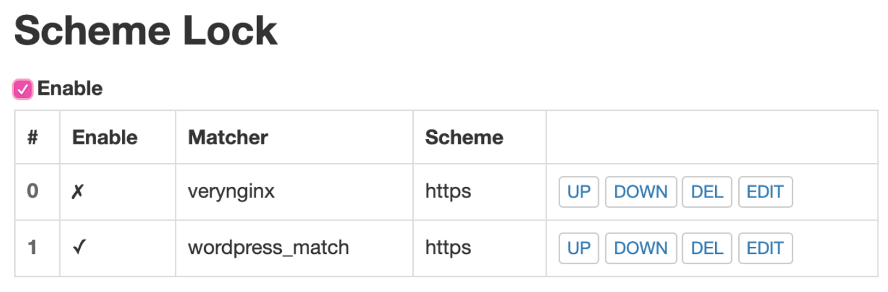

# chap0x05 web服务器

## 实验环境
ubuntu18.04.4
putty
VreyNginx
Wordpress
DVWA

## 实验步骤

1. 安装`nginx`
     `sudo apt-get update`更新
     `sudo apt-get install nginx`安装

2. 安装`Verynginx`
   安装依赖
    `sudo apt install -y libpcre3-dev libssl1.0-dev zlib1g-dev python3 unzip gcc make`
   克隆verynginx仓库到本地
    `wget https://github.com/alexazhou/VeryNginx/archive/master.zip`
    `unzip master.zip` 
   修改Verynginx配置
     `cd VeryNginx-master/`
     `sed -i "2s/nginx/cuc/" nginx.conf`修改用户名为cuc
   安装verynginx
    `sudo python3 install.py install`
   创建软链接
    `sudo ln -s /opt/verynginx/openresty/nginx/sbin/nginx /usr/sbin/verynginx`
   检查是否成功
    `sudo verynginx -t`
    输出：
    `nginx: the configuration file /opt/verynginx/openresty/nginx/conf/nginx.conf syntax is ok`
    `nginx: configuration file /opt/verynginx/openresty/nginx/conf/nginx.conf test is successful`
   启动 
    `sudo verynginx`
   无法启动,出现下面情况
  
  找到占用8080的进程号，kill掉。
  `sudo lsof -i :8080`
   登陆verynginx的web界面
  网址：`http://{{your_machine_address}}/verynginx/index.html`
  用户名和密码:`verynginx/verynginx`
  

3. 安装``wordpress``
   创建一个具有sudo权限的用户
      `sudo mysql -u root -p`以root用户身份进入
   添加用户
      ` adduser cuc`
   使用户具有sudo权限
       `usermod -aG sudo cuc`
          
   安装mysql
    `sudo apt install mysql-server`
    `sudo mysql_secure_installation`
   进入mysql
    `sudo mysql`
   修改密码，变为mysql_native_password
    `set global validate_password_policy=LOW;` 
    `ALTER USER 'root'@'localhost' IDENTIFIED WITH mysql_native_password BY 'password';`
   刷新
    `FLUSH PRIVILEGES;`
    
   .安装php
    `sudo apt install php-fpm php-mysql`
   创建wordpress数据库
    `CREATE DATABASE wordpress DEFAULT CHARACTER SET utf8 COLLATE utf8_unicode_ci;`
   授予所有权限给wordpressuser
    `GRANT ALL ON wordpress.* TO 'wordpressuser'@'localhost' IDENTIFIED BY 'password';`
   安装php扩展
    `sudo apt update`
    `sudo apt install php-curl php-gd php-intl php-mbstring php-soap php-xml php-xmlrpc php-zip`
   使php处理器更新新的特征
    `sudo systemctl restart php7.2-fpm`
   下载wordpress
     `cd /tmp`
     `curl -LO https://wordpress.org/latest.tar.gz
   解压文件
    `tar xzvf latest.tar.gz`
   将示例配置文件复制到WordPress实际读取的文件中
      `cp /tmp/wordpress/wp-config-sample.php /tmp/wordpress/wp-config.php`
   将示例配置文件复制到WordPress实际读取的文件中
       `cp /tmp/wordpress/wp-config-sample.php /tmp/wordpress/wp-config.php`

    将目录的全部内容复制到文档根目录中
    a标志用来维护权限
        `sudo cp -a /tmp/wordpress/. /var/www/html/wq.sec.cuc.edu.cn`
    分配文件所有权至nginx运行的用户和组
        `sudo chown -R www-data:www-data /var/www/html/wq.sec.cuc.edu.cn`
    从WordPress密钥生成器中获取安全值
        `curl -s https://api.wordpress.org/secret-key/1.1/salt/`
    将安全值复制到`/var/www/html/wp-config.php`中，并修改数据库的设置
     nginx配置
       改wp-config.php,更新数据库相关信息为wordpress创建配置文件/etc/nginx/sites-available/wp.sec.cuc.edu.cn
       创建软链接：`sudo ln -s /etc/nginx/sites-available/wp.sec.cuc.edu.cn /etc/nginx/sites-enabled/`
       在/etc/hosts中添加`ip wp.sec.cuc.edu.cn`
       在本机的/etc/hosts中添加同样的内容`ip wp.sec.cuc.edu.cn`
       重启nginx
       浏览器中访问可安装wordpress
      

4. 安装`DVWA`

   在/var/www/html目录下为DVWA创建目录
  `sudo mkdir /var/www/html/DVWA`
   将安装仓库克隆到临时目录下
  `git clone https://github.com/ethicalhack3r/DVWA /tmp/DVWA`
   将安装文件拷贝到/var/www/html/DVWA网站根目录下 
  `sudo rsync -avP /tmp/DVWA/ /var/www/html/DVWA`
   配置DVWA数据库连接详细信息，将此配置文件重命名
  `cp /var/www/html/DVWA/config/config.inc.php.dist /var/www/html/DVWA/config/config.inc.php`
   mysql中新建用户名DVWA
   修改DVWA文件配置：`sudo sudo vim /var/www/html/DVWA/config/config.inc.php`
   修改php配置：`vim /etc/php/7.2/fpm/php.ini`
   修改DVWA文件访问权限：`chown -R www-data.www-data /var/www/html/`
   为DVWA创建Nginx配置文件并添加服务模块:`sudo vim /etc/nginx/sites-avaliable/dvwa`
   创建软链接：`sudo ln -s /etc/nginx/sites-available/dvwa /etc/nginx/sites-enabled/`
   重启nginx
   在本机通过域名访问

5. 启用`HTTPS`

生成自签名证书
`sudo openssl req -x509 -newkey rsa:4096 -nodes -subj "/C=CN/ST=Beijing/L=Beijing/O=CUC/OU=SEC/CN=wp.sec.cuc.edu.cn" -keyout key.pem -out cert.pem -days 365`
将生成的cert.pem和key.pem放在/etc/nginx目录下
`sudo mv cert.pem /etc/nginx/`
`sudo mv key.pem /etc/nginx/`
修改/etc/nginx/sites-available/wp.sec.cuc.edu.cn 中的8080端口为”8443 ssl"
`sudo sed -i "2s/8080/8443\ ssl" wp.sec.cuc.edu.cn`
在第二行后添加cert.pem和key.pem
sudo sed -i '2a ssl_certificate      /etc/nginx/cert.pem;\nssl_certificate_key  /etc/nginx/key.pem;' wp.sec.cuc.edu.cn
 在`/opt/verynginx/openresty/nginx/conf/nginx.conf`中修改server块，使verynginx监听443端口
server {
    listen 80;
    listen 443 ssl;
    ssl_certificate      /etc/nginx/cert.pem;
    ssl_certificate_key  /etc/nginx/key.pem;
    include /opt/verynginx/verynginx/nginx_conf/in_server_block.conf;

    location = / {
        root   html;
        index  index.html index.htm;
    }
}
重新加载配置文件
 `sudo nginx -s reload`
 `sudo verynginx -s reload`
 由于刚才改了nginx对wordpress的配置文件，所以要重新去verynginx中设置一下
 保存好之后可访问HTTP
 因为此时还没有对verynginx访问强制限制https，所以`http://wp.sec.cuc.cn`和`https://wp.sec.cuc.cn`均可以访问，只是VeryNginx在访问Nginx时使用的https
 在Scheme Lock添加规则并勾选Enable，即可强制访问https
 

6. 安全加固
使用IP地址方式均无法访问上述任意站点，并且向访问者展示自定义的友好错误提示信息页面
    - matcher 
    - response 
    - filter  
Damn Vulnerable Web Application (DVWA)只允许白名单上的访客来源IP，其他来源的IP访问均向访客展示自定义的友好错误提示信息页面
   - matcher 
   - response 
   - filter 
在不升级Wordpress版本的情况下，通过定制VeryNginx的访问控制策略规则，热修复WordPress < 4.7.1 - Username Enumeration

  - 在Permalink Settings中设置Day and name
  - 访问页面`wp.sec.cuc.edu.cn/wp-json/wp/v2/users/`可以看到用户信息
  - 添加`^/wp-json/wp/v2/users.*`匹配和filter，拒绝即可
  - 通过配置VeryNginx的Filter规则实现对Damn Vulnerable Web Application (DVWA)的SQL注入实验在低安全等级条件下进行防护
VeryNginx的Web管理页面仅允许白名单上的访客来源IP，其他来源的IP访问均向访客展示自定义的友好错误提示信息页面
   - matcher 
   - response 
   - filter 
限制DVWA站点的单IP访问速率为每秒请求数 < 50, 限制Wordpress站点的单IP访问速率为每秒请求数 < 20, 超过访问频率限制的请求直接返回自定义错误提示信息页面-4
   - Response
   - Frequency Limit

## 参考资料

  - https://github.com/CUCCS/linux-2019-luyj/blob/Linux_exp0x05/Linux_exp0x05/Linux_exp0x05.md
  - https://www.digitalocean.com/community/tutorials/how-to-install-wordpress-with-lemp-on-ubuntu-18-04-to-install-lamp-stack-apachemariadb-php-7-2-on-ubuntu-18-04-lts/
  - https://blog.csdn.net/weixin_33907511/article/details/94535509
  - https://www.bilibili.com/video/BV1de411p7Vq
  - https://www.bilibili.com/video/BV1H7411s7rv