# Shell脚本编程进阶实验

## 实验环境

- 工作主机(Ubuntu-18.04.4-Server 64bit)：192.168.90.101
- 目标主机(Ubuntu-18.04.4-Server 64bit)：192.168.90.102

## 完成情况
  - [x] FTP自动安装、自动配置
  - [x] NFS自动安装、自动配置
  - [x] DHCP自动安装、自动配置
  - [x] DNS手动安装、手动配置
  - [ ] Samba手动安装、手动配置(samba.sh运行出错)


## 实验步骤
### 工作主机免密SSH登录目标主机
*  生成并导入SSH-KEY至目标主机
    - 在工作主机生成ssh-key
        ```bash
        # fur为Key的名称
        ssh-keygen -f fur
        ```
    - 修改目标主机```/etc/ssh/sshd_config```配置
        ```bash
        # 设置可通过口令认证SSH
        PasswordAuthentication yes
        # 可以root用户登录
        PermitRootLogin yes
        ```
    - 重启目标主机的SSH服务
        ```bash
        sudo systemctl restart ssh
        ```
    - 工作主机通过```ssh-copy-id```方式导入ssh-key
        ```bash
        ssh-copy-id -i ~/.ssh/id_rsa.pub u2@192.168.56.102
        ```
*  设置免密登录
    - 取消root口令并禁用口令登录
        ```bash
        sudo passwd -l root
        # 修改目标主机配置文件
        vim /etc/ssh/sshd_config
        PasswordAuthentication no
        PermitRootLogin without-password

        # 重启ssh服务
        sudo systemctl restart ssh
        ```
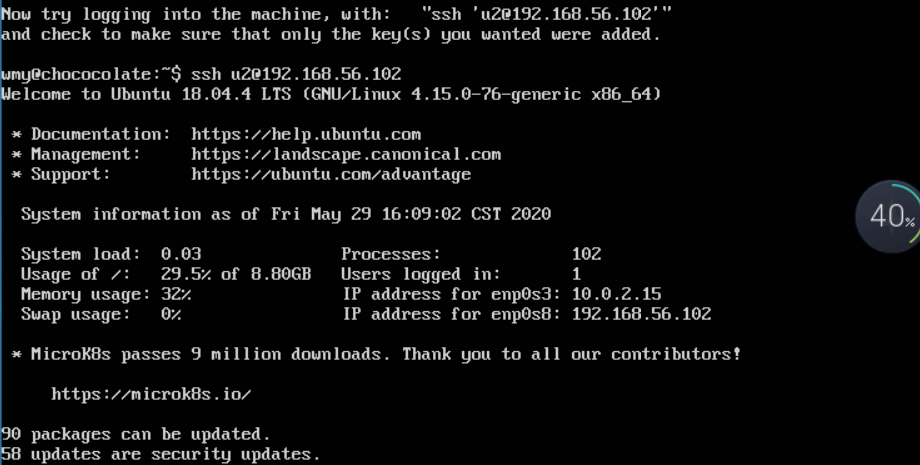


### FTP
* 服务器选择：vsftpd
* 实验文件
- [vsftpd.sh](script/vsftpd.sh)
- [vsftpd.conf](config/vsftpd.conf)
* 通过工作主机运行脚本在目标主机安装vsftpd并完成相关配置
     - 将脚本文件`vsftpd.sh`拷贝到目标主机：
     `scp -i ~/.ssh/id_rsa -r /home/wmy/vsftpd.sh u2@192.168.56.102:workspace/ `
     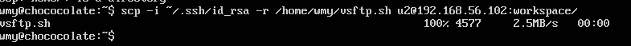
     - 借助SSH远程登陆目标主机，执行：
     `bash workspace/vsftpd.sh'`
     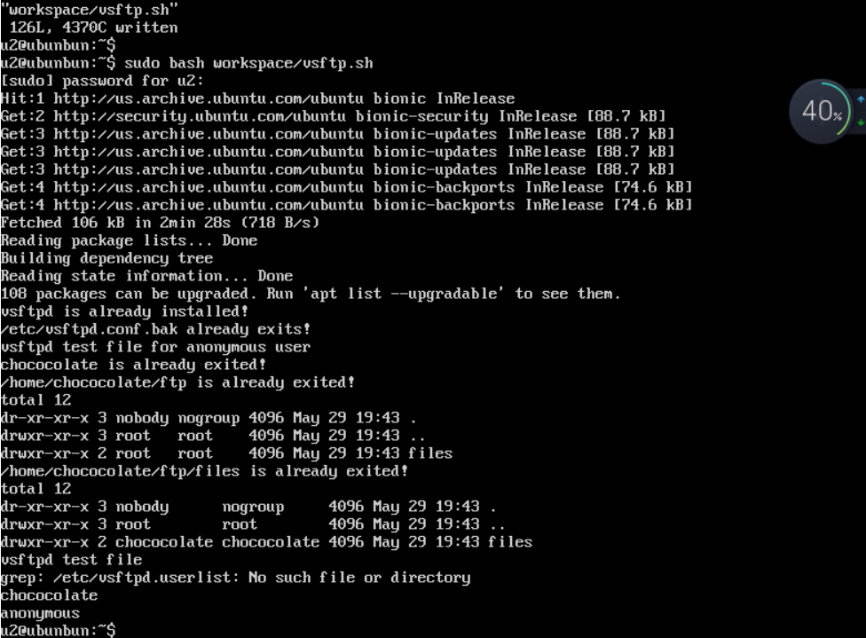
* 配置一个支持用户名和密码方式访问的账号，该账号继承匿名访问者所有权限，且拥有对另1个独立目录及其子目录完整读写（包括创建目录、修改文件、删除文件等）权限
     - 在chococolate用户的目录下出现了匿名用户目录下的文件，可证明继承匿名者访问权限
     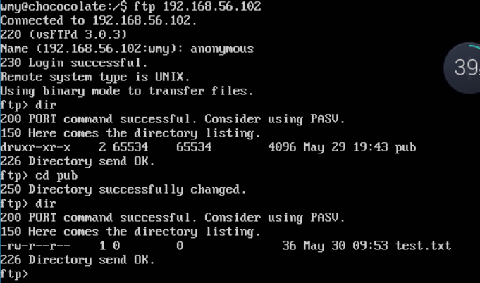
     - 删除文件、创建目录、修改文件 & FTP用户不能越权访问指定目录之外的任意其他目录和文件
     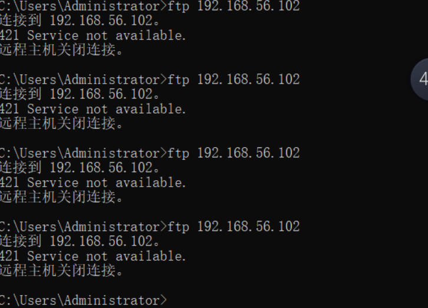
     - 匿名访问权限仅限白名单IP来源用户访问，禁止白名单IP以外的访问
     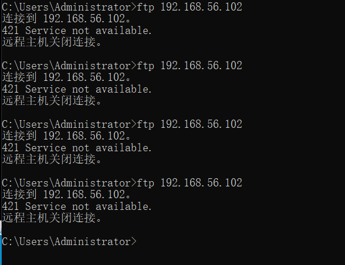


### NFS
*  实验文件
- [nfs_c.sh](script/nfs_c.sh)
- [nfs_s.sh](script/nfs_s.sh)
- [exports](config/exports)
* 将nfs_s.sh拷贝到目标主机，工作主机运行nfs_s.sh脚本
   `scp -i ~/.ssh/id_rsa -r /home/wmy/nfs_s.sh u2@192.168.56.102:workspace/nfs_s.sh`、
   `ssh -i ~/.ssh/id_rsa -r u2@192.168.56.102 'bash workspace/nfs_s.sh'`
- 在目标主机通过进程查看nfs服务是否运行
     ps -aux|grep -v grep|grep nfs
- 工作主机运行nfs_c.sh脚本 `bash nfs_c.sh`
- 在1台Linux上配置NFS服务，另1台电脑上配置NFS客户端挂载2个权限不同的共享目录，分别对应只读访问和读写访问权限
-  创建的两个目录分别为:只读`/nfs/gen_r`和读写`/nfs/gen_rw`

* 客户端共享目录中文件、子目录的属主、权限信息和在NFS服务器端的信息,uid和gid一致
     - client
      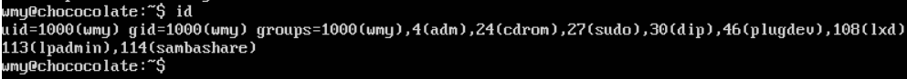
     - server
      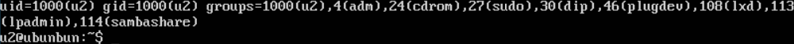
    
### DHCP
* 实验文件
- [dhcp.sh](script/dhcp.sh)
- [dhcpd.conf](config/dhcpd.conf)
- [isc-dhcp-server](config/isc-dhcp-server)
    
* client [intnet网卡]
    ```bash
    network:
    version: 2
    renderer: networkd
    ethernets:
        enp0s3:
            dhcp4: yes
        enp0s8:
            dhcp4: yes
        enp0s9:
            dhcp4: yes
    ```
* server [intnet网卡]
    ```bash
    network:
    version: 2
    renderer: networkd
    ethernets:
        enp0s3:
            dhcp4: yes
        enp0s8:
            dhcp4: yes
        enp0s9:
            # 必须静态配置
            dhcp4: no
            addresses: [192.168.57.1/24]
    ```
* Server
运行脚本
* Client
- 在```/etc/01-netcfg.yaml```文件中添加```enp0s9```,设置```dhcp4: yes```
- ```sudo netplan apply```使配置生效
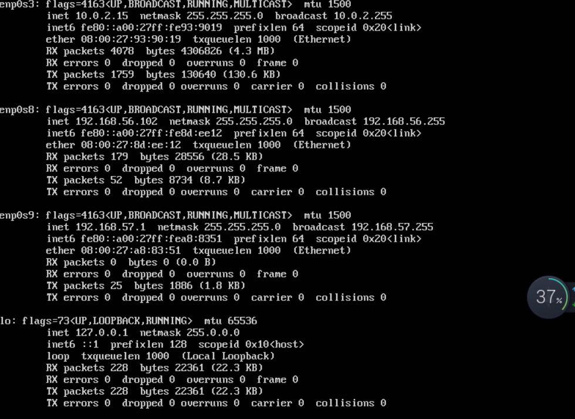

### DNS
  * 基于上述Internal网络模式连接的虚拟机实验环境，在DHCP服务器上配置DNS服务，使得另一台作为DNS客户端的主机可以通过该DNS服务器进行DNS查询
  * 在DNS服务器上添加 zone "cuc.edu.cn" 的解析记录
  * server

    * 安装bind9：`sudo apt update && sudo apt install bind9`
    * 修改配置文件`sudo vim /etc/bind/named.conf.options`

          #在options选项中添加以下配置
          listen-on { 192.168.56.102; };  # ns1 private IP address - listen on private network only
          allow-transfer { none; }; # disable zone transfers by default
          forwarders {
             8.8.8.8;
              8.8.4.4;
          };
    * 编辑配置文件`sudo vim /etc/bind/named.conf.local`

          #添加如下配置
          zone "cuc.edu.cn" {
              type master;
              file "/etc/bind/db.cuc.edu.cn";
          };
    * 生成配置文件`db.cuc.edu.cn`

          $ sudo cp /etc/bind/db.local /etc/bind/db.cuc.edu.cn
    * 编辑配置文件`sudo vim /etc/bind/db.cuc.edu.cn`
    * 重启bind9：`sudo service bind9 restart`

  * client
     * 安装resolvconf：`sudo apt update && sudo apt install resolvconf`

     * 修改配置文件：`sudo vim /etc/resolvconf/resolv.conf.d/head`

            #添加配置
            search cuc.edu.cn
            nameserver 192.168.57.1
      * sudo resolvconf -u
  * 测试结果：
    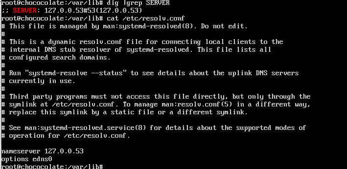
    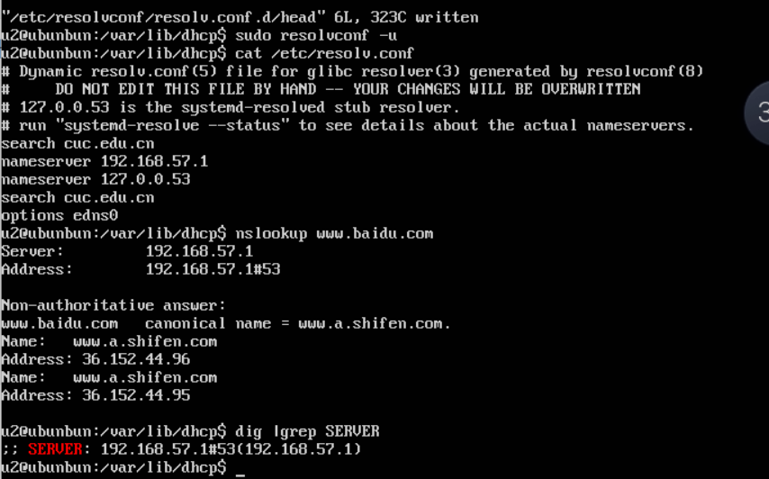


### 参考资料
* [how-to-share-files-between-windows-and-linux](https://www.howtogeek.com/176471/how-to-share-files-between-windows-and-linux/)
* [getting-whole-folder-using-smbclient](https://indradjy.wordpress.com/2010/04/14/getting-whole-folder-using-smbclient/)
* [how to set up passwordless ssh access for root user](https://askubuntu.com/questions/115151/how-to-set-up-passwordless-ssh-access-for-root-user)
* [proftpd vs pureftpd vs vsftpd](https://systembash.com/evaluating-ftp-servers-proftpd-vs-pureftpd-vs-vsftpd/)
* [vsftpd](https://security.appspot.com/vsftpd.html)
* [cuc-linux](https://github.com/CUCCS/linux-2019-luyj/blob/Linux_exp0x06/Linux_exp0x06/Linux_exp0x06.md)
* [how to set up an nfs mount on ubuntu 18.04](https://www.digitalocean.com/community/tutorials/how-to-set-up-an-nfs-mount-on-ubuntu-18-04) 
* [using-sed-to-copy-lines-and-delete-characters-from-the-duplicates](https://stackoverflow.com/questions/7369047/using-sed-to-copy-lines-and-delete-characters-from-the-duplicates)
* [how-to-comment-a-line-based-on-the-word-it-starts-with](https://unix.stackexchange.com/questions/336767/how-to-comment-a-line-based-on-the-word-it-starts-with)
* [ftp/video/Linux/2018/2018-04-24-2010-22-51.mp4](http://sec.cuc.edu.cn/ftp/video/Linux/2018/2018-04-24%2010-22-51.mp4)